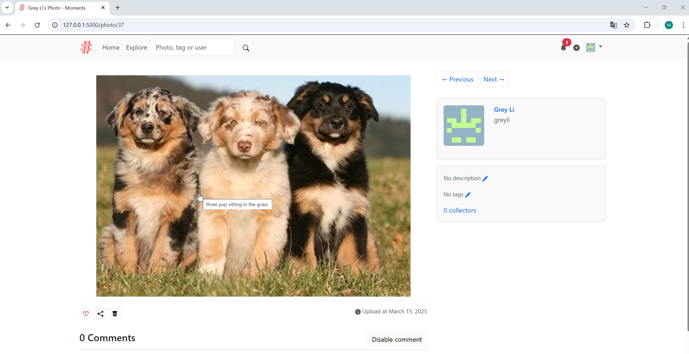
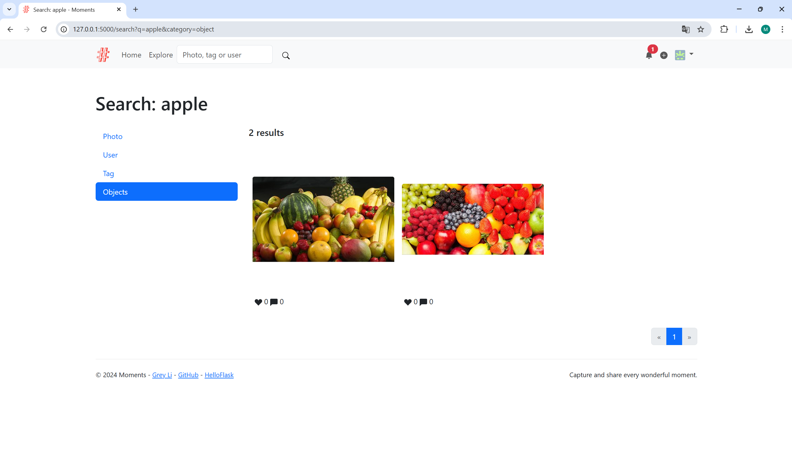

# Individual Assignment 1: Building an ML-enabled Product

## Task

**Introduce ML-powered features.** Change the open source project to introduce at a minimum the following two features:

* *Alternative text generation:* Provide an automatically generated alternative text for images if users do not provide their own. In *albumy* you can use the existing description field or add a new mechanism to store the alternative text.
* *Image search:* Identify objects in images so that images can be searched with keywords. In *albumy*, you can use the existing functionality for tags or add a new hidden mechanism for storing identified objects.

You can use any existing ML models as part of your implementation, research or free or paid, remote APIs or local pretrained models. We do *not* recommend to train your own model.

